# Retrieval-Augmented Generation (RAG)

Retrieval-Augmented Generation (RAG) is an architectural pattern that optimizes the output of a Large Language Model (LLM) by referencing an authoritative external knowledge base outside of its training data before generating a response.

As an **Applied AI developer**, RAG is one of the most cost-effective and accurate ways to connect your business data, private documents, or real-time APIs to pre-trained LLMs without the extreme cost and complexity of fine-tuning.

---

## Why Do We Need RAG?

Pre-trained LLMs have specific limitations:
1. **Knowledge Cutoff**: They only know information up to their training date.
2. **Lack of Private Data**: They cannot answer questions about your private database, local codebase, or proprietary documentation.
3. **Hallucinations**: When an LLM doesn't know the answer, it tends to make up plausible-sounding but incorrect information.
4. **Fine-Tuning Cost**: Fine-tuning a model is expensive, requires specialized ML expertise, and is hard to update dynamically.

**RAG solves these problems** by dynamically fetching relevant context and passing it straight to the LLM's context window along with the user's prompt.

---

## The RAG Architecture

A typical RAG pipeline is split into two distinct phases: **Ingestion/Indexing (Offline/Pre-processing)** and **Retrieval & Generation (Online/Runtime)**.

### RAG Workflow Diagram

```mermaid
flowchart TD
    subgraph Ingestion_Phase["Phase 1: Ingestion & Indexing (Offline)"]
        A[Raw Documents: PDF, MD, HTML] --> B[Text Chunking & Splitting]
        B --> C[Generate Embeddings via Embedding Model]
        C --> D[(Vector Database)]
    end

    subgraph Retrieval_Generation_Phase["Phase 2: Retrieval & Generation (Online/Runtime)"]
        UserPrompt[User Query] --> EmbedQuery[Generate Query Embedding]
        EmbedQuery --> SearchDB[(Vector Database)]
        SearchDB -->|Retrieve Top-K Matches| Context[Retrieve Context Chunks]
        Context --> BuildPrompt[Augment Prompt: System Context + User Query]
        UserPrompt --> BuildPrompt
        BuildPrompt --> LLM[LLM Engine]
        LLM --> Output[Final Generated Answer]
    end
    
    style Ingestion_Phase fill:#f5f7ff,stroke:#5c7cfa,stroke-width:2px
    style Retrieval_Generation_Phase fill:#fff9db,stroke:#fcc419,stroke-width:2px
```



---

## Core Components Deep Dive

### 1. Chunking and Splitting
When indexing long files, we cannot feed entire textbooks or 100MB documents into the embedding model at once because of token limits and loss of semantic focus. We must divide documents into smaller, coherent text blocks ("chunks").
*   **Fixed-size Chunking**: Splitting by a set number of characters or tokens.
*   **Recursive Character Chunking**: Splitting by paragraph, then sentence, then word, trying to keep chunks under a target size. This preserves paragraphs intact.
*   **Chunk Overlap**: We keep a small overlap (e.g., 10–20%) between contiguous chunks. This ensures that information located on boundaries isn't lost.

### 2. Vector Embeddings
An embedding model converts text into a high-dimensional vector (an array of floating-point numbers, e.g., 1536 numbers). 
*   **Spatial Semantics**: Text passages with similar meanings are represented by vectors that are mathematically close to each other in vector space.
*   *Example*: "I love kittens" and "Felines make great pets" will have highly similar vector embeddings, even though they share almost no identical words.

### 3. Vector Database
Vector Databases store embeddings along with their raw text and metadata (source file, category, page number). 
*   Unlike SQL databases that query using exact matches or text patterns, Vector DBs use distance metrics to find vectors closest to the query.
*   **Common Metrics**:
    *   **Cosine Similarity**: Measures the cosine of the angle between two vectors (independent of magnitude). Most common for text embeddings.
    *   **Euclidean Distance (L2)**: Measures straight-line distance.
    *   **Dot Product**: Measures direction and magnitude (very fast if vectors are normalized).

### 4. Prompt Augmentation & Generation
Once the top context chunks are retrieved, they are inserted into a structured prompt layout:

```text
You are a helpful assistant. Use ONLY the context provided below to answer the user's question. 
If the answer cannot be found in the context, say "I don't know".

[CONTEXT]
- Chunk 1: Antigravity is a coding assistant built by Google DeepMind...
- Chunk 2: The Antigravity workspace resides at /Users/pratapdas/Developer/...

[USER QUESTION]
Where does the Antigravity workspace reside?
```

---

## Implementation: In-Memory RAG in Vanilla Node.js

Here is a complete, self-contained implementation demonstrating how to build a RAG pipeline from scratch using the `openai` SDK and standard Node.js logic. 

To run this, make sure your `.env` file contains your credentials (like `OPENAI_API_KEY` and optional `OPENAI_BASE_URL`).

### Code Example (`indexing.js`)

```javascript
import OpenAI from "openai";
import dotenv from "dotenv";
import fs from "fs/promises";
import path from "path";
import { fileURLToPath } from "url";

// Resolve paths correctly relative to this script file
const __filename = fileURLToPath(import.meta.url);
const __dirname = path.dirname(__filename);
const envPath = path.join(__dirname, "../.env");
const indexPath = path.join(__dirname, "vector_index.json");

// Configure dotenv
dotenv.config({ path: envPath });

// Initialize OpenAI client
const client = new OpenAI({
  apiKey: process.env.OPENAI_API_KEY,
  baseURL: process.env.OPENAI_BASE_URL,
  timeout: 15000,
});

// Sample raw documents representing our mock knowledge base
const KNOWLEDGE_BASE = [
  {
    id: "rag-definition",
    content: "Retrieval-Augmented Generation (RAG) is a technique that uses external search results to augment the prompt of a Generative AI model. This grounds the model's output in real facts and prevents hallucination.",
    source: "rag_basics.txt"
  },
  {
    id: "mcp-info",
    content: "When building agentic workflows, Model Context Protocol (MCP) acts as an open standard for developers to build secure, robust integrations between AI models and local development environments.",
    source: "mcp_intro.md"
  },
  {
    id: "chunking-guide",
    content: "Chunking is the process of breaking down large documents into smaller text passages. Recursive chunking splits text on double newlines, then single newlines, then spaces, to preserve semantic units like paragraphs and sentences.",
    source: "chunking_strategies.txt"
  },
  {
    id: "vector-db-info",
    content: "Vector Databases store floating-point vector representations of text. When a user query is sent, the database performs cosine similarity to find the vectors closest to the query embedding, returning them as context.",
    source: "vector_databases.txt"
  },
  {
    id: "applied-ai-focus",
    content: "Pratap Das is building Applied AI applications using Node.js, focusing on cost-effective token usage, semantic retrieval, and agent workflows using OpenAI and Anthropic SDKs.",
    source: "developer_profile.txt"
  }
];

// --- TF-IDF Local Vectorizer (Sparse Embeddings) ---
// Since the Bedrock proxy doesn't expose a dedicated embedding model,
// we implement a local TF-IDF vectorizer to build term-frequency vectors and run Cosine Similarity.
class LocalTFIDF {
  constructor(docs) {
    this.docs = docs;
    this.vocab = [];
    this.idf = {};
    this.buildVocab();
  }

  tokenize(text) {
    return text
      .toLowerCase()
      .replace(/[^a-z0-9\s-]/g, "")
      .split(/\s+/)
      .filter(word => word.length > 2);
  }

  buildVocab() {
    const allWords = new Set();
    const docWordCounts = [];

    this.docs.forEach(doc => {
      const tokens = this.tokenize(doc.content);
      const wordMap = {};
      tokens.forEach(token => {
        wordMap[token] = (wordMap[token] || 0) + 1;
        allWords.add(token);
      });
      docWordCounts.push(wordMap);
    });

    this.vocab = Array.from(allWords);

    const N = this.docs.length;
    this.vocab.forEach(word => {
      const docsWithWord = docWordCounts.filter(map => map[word] > 0).length;
      this.idf[word] = Math.log(1 + N / (docsWithWord || 1));
    });
  }

  vectorize(text) {
    const tokens = this.tokenize(text);
    const tf = {};
    tokens.forEach(token => {
      tf[token] = (tf[token] || 0) + 1;
    });

    const vector = this.vocab.map(word => {
      const termFreq = tf[word] || 0;
      const invDocFreq = this.idf[word] || 0;
      return termFreq * invDocFreq;
    });

    const magnitude = Math.sqrt(vector.reduce((sum, val) => sum + val * val, 0));
    if (magnitude === 0) return vector;
    return vector.map(val => val / magnitude);
  }
}

function cosineSimilarity(vecA, vecB) {
  let dotProduct = 0.0;
  for (let i = 0; i < vecA.length; i++) {
    dotProduct += vecA[i] * vecB[i];
  }
  return dotProduct;
}

async function buildIndex() {
  console.log("=== Phase 1: Building Local Vector Index (TF-IDF) ===");
  const vectorizer = new LocalTFIDF(KNOWLEDGE_BASE);
  const indexedDocs = KNOWLEDGE_BASE.map(doc => {
    const vector = vectorizer.vectorize(doc.content);
    return {
      id: doc.id,
      content: doc.content,
      source: doc.source,
      vector
    };
  });

  const indexPayload = {
    vocab: vectorizer.vocab,
    idf: vectorizer.idf,
    documents: indexedDocs
  };

  await fs.writeFile(indexPath, JSON.stringify(indexPayload, null, 2), "utf-8");
  console.log(`Vector index successfully written to: ${indexPath}\n`);
  return indexPayload;
}

async function queryIndex(userQuery, topK = 1) {
  console.log(`=== Phase 2: Performing Semantic Search ===`);
  console.log(`Search Query: "${userQuery}"`);
  
  let indexPayload;
  try {
    const fileData = await fs.readFile(indexPath, "utf-8");
    indexPayload = JSON.parse(fileData);
  } catch (err) {
    console.log("Vector index not found. Building index first...");
    indexPayload = await buildIndex();
  }

  const vectorizer = new LocalTFIDF([]);
  vectorizer.vocab = indexPayload.vocab;
  vectorizer.idf = indexPayload.idf;

  const queryVector = vectorizer.vectorize(userQuery);

  const scoredDocs = indexPayload.documents.map(doc => {
    const similarity = cosineSimilarity(queryVector, doc.vector);
    return {
      id: doc.id,
      content: doc.content,
      source: doc.source,
      similarity
    };
  });

  scoredDocs.sort((a, b) => b.similarity - a.similarity);

  console.log("\nTop Matches found:");
  const topMatches = scoredDocs.slice(0, topK);
  topMatches.forEach((match, index) => {
    console.log(`[Rank ${index + 1}] Similarity: ${match.similarity.toFixed(4)} | Source: ${match.source}`);
    console.log(`Content: "${match.content}"\n`);
  });

  return topMatches[0];
}

async function runRAGPipeline(query) {
  const bestMatch = await queryIndex(query, 1);

  if (!bestMatch || bestMatch.similarity === 0) {
    console.log("No relevant context found. Defaulting to general LLM query.");
  }

  console.log("=== Phase 3: Generating Answer via LLM ===");
  const systemPrompt = `You are a helpful assistant. Answer the user's question using ONLY the provided context. If you cannot answer using the context, state "I cannot find the answer in the context."

[CONTEXT]
${bestMatch ? bestMatch.content : "No context available."}
Source: ${bestMatch ? bestMatch.source : "N/A"}`;

  console.log(`Augmented prompt prepared. Invoking model "openai.gpt-oss-120b"...`);

  try {
    const result = await client.responses.create({
      model: "openai.gpt-oss-120b",
      input: `${systemPrompt}\n\n[USER QUESTION]\n${query}`,
    });

    console.log(`\n=== FINAL ANSWER ===\n${result.output_text}\n`);
  } catch (error) {
    console.error("Failed to generate response using responses.create, trying chat.completions fallback...");
    try {
      const completion = await client.chat.completions.create({
        model: "openai.gpt-oss-120b",
        messages: [
          { role: "system", content: systemPrompt },
          { role: "user", content: query }
        ],
        temperature: 0.1
      });
      console.log(`\n=== FINAL ANSWER (Fallback) ===\n${completion.choices[0].message.content}\n`);
    } catch (fallbackError) {
      console.error("All LLM invocation attempts failed:", fallbackError.message);
    }
  }
}

// Run the script
async function main() {
  if (!process.env.OPENAI_API_KEY) {
    console.error("Error: OPENAI_API_KEY is not defined in your environment/dotenv variables.");
    process.exit(1);
  }

  await buildIndex();

  const testQuery = "What is Model Context Protocol (MCP) and how does it help AI models?";
  await runRAGPipeline(testQuery);
}

main().catch(err => {
  console.error("Execution failed:", err);
});
```

---

## Qdrant & Local Transformers RAG (For AWS Bedrock)

Since AWS Bedrock's OpenAI-compatible proxy (`bedrock-mantle`) does not expose standard vector embedding endpoints (resulting in `404 model not found` errors), we can run **embeddings locally** in Node.js using `@huggingface/transformers` and index them into a local **Qdrant Vector Database**.

### Ingest & Indexing Code (`indexing.js`)

```javascript
import OpenAI from "openai";
import dotenv from "dotenv";
import { PDFLoader } from "@langchain/community/document_loaders/fs/pdf";
import { HuggingFaceTransformersEmbeddings } from "@langchain/community/embeddings/huggingface_transformers";
import { QdrantVectorStore } from "@langchain/qdrant";
import path from "path";
import { fileURLToPath } from "url";

const __filename = fileURLToPath(import.meta.url);
const __dirname = path.dirname(__filename);
const envPath = path.join(__dirname, "../.env");
const defaultPdfPath = path.join(__dirname, "Recursion & Backtracking.pdf");

dotenv.config({ path: envPath });

async function generateVectorEmbaddingForFile(filepath) {
    if (!filepath) {
        throw new Error("No PDF filepath specified.");
    }

    console.log(`Loading PDF content from: ${filepath}`);
    const loader = new PDFLoader(filepath);
    const documents = await loader.load();

    console.log(`Successfully loaded ${documents.length} pages/documents.`);

    // Initialize local embeddings (runs 100% locally via ONNX without API endpoints)
    const embedding = new HuggingFaceTransformersEmbeddings({
        modelName: "Xenova/all-MiniLM-L6-v2",
    });

    console.log("Connecting to Qdrant vector store at http://localhost:6333...");
    
    // Create or append to collection in Qdrant DB
    const vectorStore = await QdrantVectorStore.fromDocuments(
        documents,
        embedding,
        {
            url: 'http://localhost:6333',
            collectionName: 'vectorDBForRAG'
        }
    );

    console.log(`Successfully indexed all documents in Qdrant collection 'vectorDBForRAG'.`);
}

generateVectorEmbaddingForFile(defaultPdfPath).catch((err) => {
    console.error("\n[Error during indexing execution]:");
    console.error(err.stack || err.message);
});
```

### Retrieval & Generation Code (`query.js`)

```javascript
import OpenAI from "openai";
import dotenv from "dotenv";
import { HuggingFaceTransformersEmbeddings } from "@langchain/community/embeddings/huggingface_transformers";
import { QdrantVectorStore } from "@langchain/qdrant";
import path from "path";
import { fileURLToPath } from "url";

const __filename = fileURLToPath(import.meta.url);
const __dirname = path.dirname(__filename);
const envPath = path.join(__dirname, "../.env");

dotenv.config({ path: envPath });

const client = new OpenAI({
  apiKey: process.env.OPENAI_API_KEY,
  baseURL: process.env.OPENAI_BASE_URL,
});

async function queryRAG(userQuery) {
  console.log(`\nUser Question: "${userQuery}"`);

  const embedding = new HuggingFaceTransformersEmbeddings({
    modelName: "Xenova/all-MiniLM-L6-v2",
  });

  console.log("Connecting to Qdrant vector store...");
  const vectorStore = await QdrantVectorStore.fromExistingCollection(
    embedding,
    {
      url: "http://localhost:6333",
      collectionName: "vectorDBForRAG",
    }
  );

  console.log("Performing similarity search...");
  const searchResults = await vectorStore.similaritySearch(userQuery, 2);

  if (searchResults.length === 0) {
    console.log("No matching context found.");
    return;
  }

  const contextText = searchResults.map(doc => doc.pageContent).join("\n\n");
  console.log(`\n=== Retrieved Context (Top Matches) ===\n${contextText}\n`);

  console.log("Generating response using Bedrock Mantle (openai.gpt-oss-120b)...");
  const systemPrompt = `You are a helpful assistant. Answer the user's question using ONLY the provided context below. If you cannot answer using the context, state "I cannot find the answer in the context."

[CONTEXT]
${contextText}`;

  try {
    const result = await client.responses.create({
      model: "openai.gpt-oss-120b",
      input: `${systemPrompt}\n\n[USER QUESTION]\n${userQuery}`,
    });

    console.log(`\n=== FINAL ANSWER ===\n${result.output_text}\n`);
  } catch (error) {
    console.error("Failed to generate response, trying chat.completions fallback...");
    try {
      const completion = await client.chat.completions.create({
        model: "openai.gpt-oss-120b",
        messages: [
          { role: "system", content: systemPrompt },
          { role: "user", content: `${userQuery}` }
        ],
        temperature: 0.1,
      });
      console.log(`\n=== FINAL ANSWER (Fallback) ===\n${completion.choices[0].message.content}\n`);
    } catch (fallbackError) {
      console.error("All LLM invocation attempts failed:", fallbackError.message);
    }
  }
}

const question = "What rules must a Sudoku solution satisfy?";
queryRAG(question).catch(console.error);
```

---

## Applied AI Best Practices

1. **Chunk Size vs. Count**: 
   * Smaller chunks (128–512 tokens) pinpoint exact answers better and save context tokens.
   * Larger chunks (512–1024 tokens) provide rich background context but can clutter prompt size.
2. **Metadata Filtering**: 
   * Always tag chunks with metadata (e.g., `{ userId: '123', folder: 'GenAI' }`).
   * Perform database metadata filtering *before* running vector search to restrict scope, improve security, and speed up indexing.
3. **Hybrid Search**: 
   * Pure vector search can struggle with exact keyword matching (e.g., searching for product serial numbers or specific UUIDs like `SKU-49102`).
   * Combine Vector Search (Semantic) with Keyword Search (BM25 or full-text indexes) to build a robust system.
4. **Re-Ranking**:
   * Retrieve a larger pool of documents (e.g., Top-25) using fast vector search.
   * Pass them through a specialized **Re-Ranker Model** (like Cohere Re-rank or Cross-Encoder models) to determine the top 3-5 most critical paragraphs to actually feed into the LLM context.
